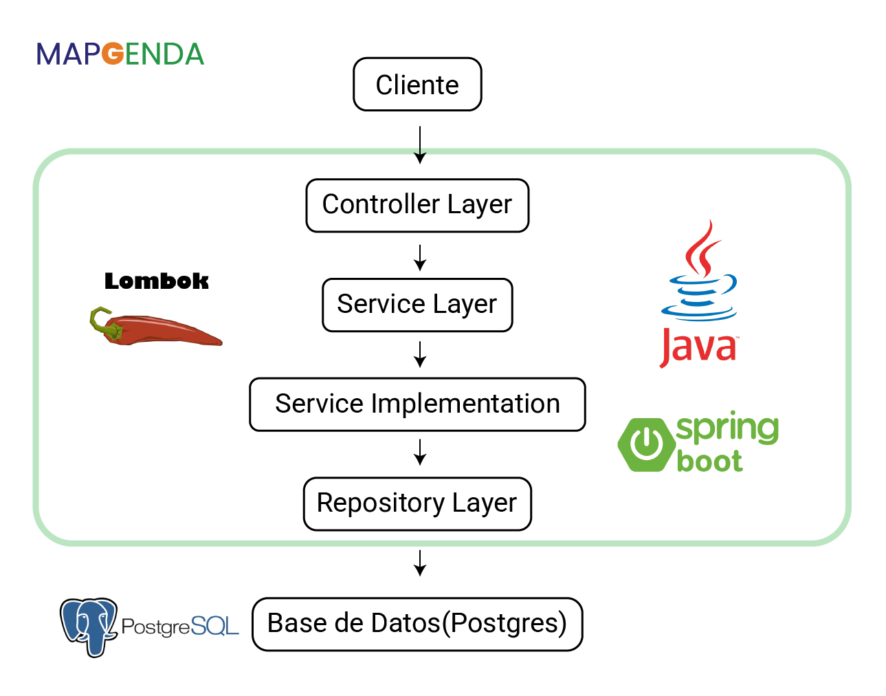
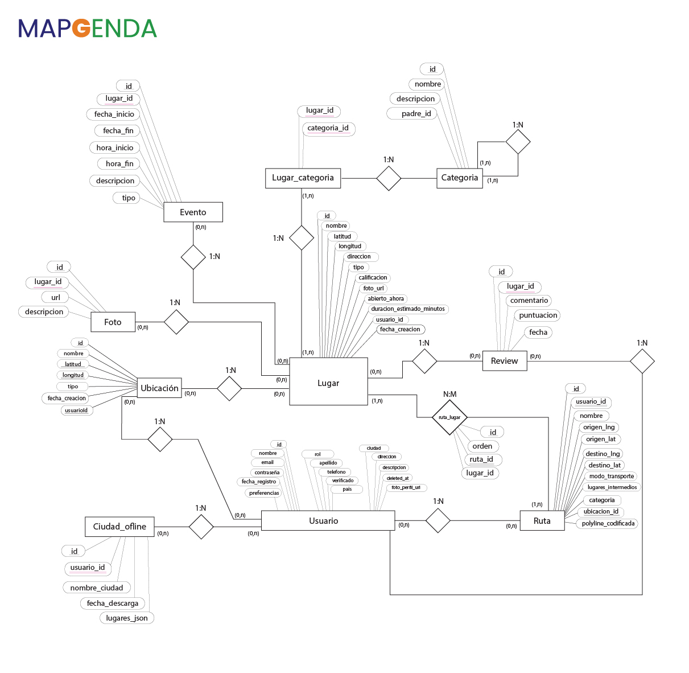

# 🛠️ Mapgenda Backend

API REST desarrollada en Java con Spring Boot, diseñada para servir como backend de la aplicación móvil **Mapgenda**. Se encarga de la autenticación de usuarios, el almacenamiento seguro en la nube, la gestión de contenidos multimedia y la sincronización eficiente de datos entre el cliente móvil y los servicios de terceros como **Google Sign-In** y **Cloudinary**.

---

## 🌐 Arquitectura General

---

## ✨ Funcionalidades Principales

- Registro y autenticación con **Google Sign-In**
- Gestión de sesiones JWT
- Almacenamiento y carga de contenido multimedia vía **Cloudinary**
- Persistencia de datos con PostgreSQL + JPA
- API RESTful para la sincronización con la app móvil
- Seguridad robusta con **Spring Security**

---

## ⚙️ Stack Tecnológico

| Componente        | Tecnología                                  |
|-------------------|---------------------------------------------|
| **Framework**     | Spring Boot 3.4.4                           |
| **Lenguaje**      | Java 21                                     |
| **Build Tool**    | Maven                                       |
| **Base de Datos** | PostgreSQL + Spring Data JPA               |
| **Seguridad**     | Spring Security + JWT                      |
| **Autenticación** | Google Sign-In API                         |
| **DTO ↔ Entidades**| MapStruct                                  |
| **Boilerplate**   | Lombok                                      |
| **JSON Mapper**   | Jackson                                     |

---

## 🖼️ Visual Tech Stack

---

## 🚀 Instalación y Ejecución

### 🔧 Requisitos Previos

- JDK 21 instalado
- PostgreSQL en ejecución con base de datos creada
- Maven 3.8+ instalado

### 📥 Clonar el repositorio

git clone https://github.com/Yucsan/Mapgenda_Backend.git
cd Mapgenda_Backend

## 🗄️ Diseño de la Base de Datos

El esquema de base de datos se encuentra ubicado en la carpeta [`mapgenda_db`](mapgenda_db/mapgenda_db.sql).

Al diseñar el esquema de la base de datos, uno de los retos clave fue darle **escalabilidad geográfica** a la aplicación. En principio la app estaba pensada para funcionar en una sola ciudad, como Sevilla, pero quería que fuera capaz de operar en **cualquier lugar del mundo**.

Fue entonces cuando me di cuenta de que los *lugares* por sí solos no eran suficientes para construir búsquedas eficientes ni organizar rutas globales. Necesitaba una **capa adicional** que agrupara esos lugares y permitiera consultas por zona. Así nació la entidad **Ubicación**.

Técnicamente podría parecer que una “ubicación” es lo mismo que un “lugar”, pero conceptualmente son diferentes: una **Ubicación** sirve para **agrupar múltiples lugares en una misma zona** — un distrito, barrio o ciudad — lo que permite realizar **filtros espaciales**, cachear datos offline de regiones enteras, y escalar fácilmente la app a otros países.

Además, esta separación dota de **flexibilidad al sistema**: puedo mantener los lugares tal cual vienen de Google Places, mientras las ubicaciones me permiten definir ámbitos de descarga, búsqueda y navegación, **sin duplicar información ni comprometer el modelo**. El resultado es una arquitectura pensada para **crecer geográficamente, sin rehacer el diseño base**.

